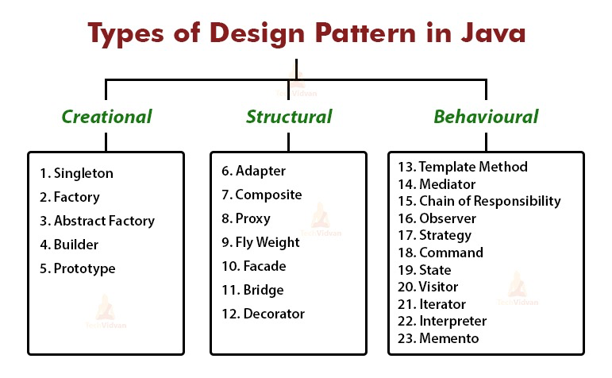

| Category   | Primary Focus            | Top Examples                  |
|------------|--------------------------|-------------------------------|
| Creational | Object Instantiation     | Singleton, Factory, Builder   |
| Structural | Class/Object Assembly    | Adapter, Decorator, Facade    |
| Behavioral | Object Interaction       | Observer, Strategy, Iterator  |

### Useful Links
https://refactoring.guru/design-patterns/singleton

# Creational 

## Singleton
Singleton is a creational design pattern that lets you ensure that a class <b> has only one instance </b>, while providing a global access point to this instance.

## Factory
Factory method is a creational design pattern which solves the problem of creating product objects without specifying their concrete classes.
<b>The Factory Method defines a method, which should be used for creating objects instead of using a direct constructor call (new operator).</b>
Subclasses can override this method to change the class of objects that will be created.